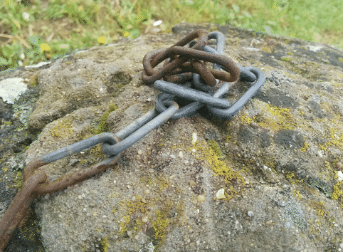
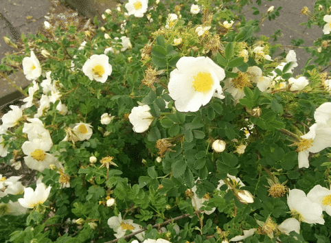
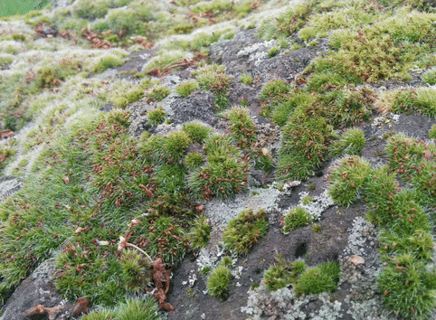
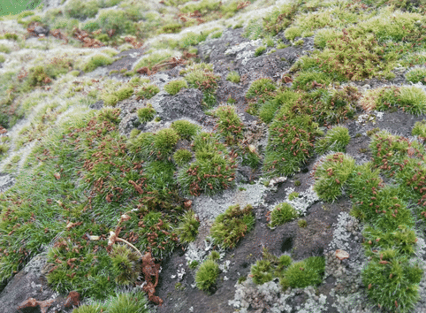

pyLensBlurWigglegram
====================

Script that extracts the depth image for a Google Lens Blur image and uses it to create a Wigglegram

##Introduction
This is a simple script that takes a [Lens Blur](http://googleresearch.blogspot.de/2014/04/lens-blur-in-new-google-camera-app.html) photo produced with Google's Android Camera application, extracts the depth information, and creates a [wigglegram](https://en.wikipedia.org/wiki/Wiggle_stereoscopy).  This script was inspired by [depthy](http://depthy.stamina.pl/), a web-app/viewer for Google's Lens Blur images.

The script loads the image produced by the Lens Blur function, extracts the original image and the depth image stored in the metadata, and then creates a series of frames where the original image is displaced by the depth image values.  The script then saves the frames to an animated GIF.

##Prerequisites
You will need Python 2.7.6 and the following libraries (tested versions in parentheses):
* images2gif (1.0.1)
* numpy (1.8.1)
* PIL (1.1.7)
* scipy (0.13.3)

##Installation & Usage
After you have all the prerequisites installed, you should download the script to your location of choice.  You can run the script with the default options using the following CLI command:
```
python pyLensBlurWigglegram.py INPUTFILE
```

To get information about the different CLI options, run:
```
python pyLensBlurWigglegram.py -h
```

Here are demonstrations to process the included examples:
```
python pyLensBlurWigglegram.py exampleimages/example1.jpg -ri 0.5
```

```
python pyLensBlurWigglegram.py exampleimages/example2.jpg -ri 0.5
```

```
python pyLensBlurWigglegram.py exampleimages/example3.jpg -o exampleimages/example3_focusclose.gif -d 0.1 -ri 0.5
```

```
python pyLensBlurWigglegram.py exampleimages/example3.jpg -o exampleimages/example3_focusfar.gif -d 0.9 -ri 0.5
```


##Related Resources
* [Information on identifying and extracting the depth map from a Lens Blur image](http://lunokhod.org/?p=1486)
* [PIL image resizing information](http://stackoverflow.com/questions/1386400/pil-image-resizing-algorithm-similar-to-firefoxs)
* [Reddit Wigglegram subreddit](http://www.reddit.com/r/wigglegrams)
